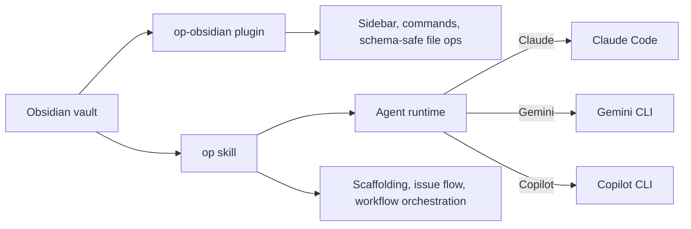

# obsidian-projects

An issue tracker and agent orchestrator for agentic software development, designed to allow autonomous workflows with maximum visilibity.

Agent harness agnostic, shipping with initial detection and adapter support for claude, copilot and gemini CLI.

obsidian-projects turns an Obsidian vault into a durable project workspace. Issues live as markdown notes, agents launch from the work itself, and deterministic vault operations stay inside a native Obsidian plugin instead of being left to raw LLM file edits.



## Why it exists

Most agent workflows still split the source of truth across chat history, issue trackers, scratch docs, and local scripts. This project keeps the work in one place:

- **Obsidian** holds projects, issues, workflow modules, and durable notes.
- **`op`** provides the agent-facing workflow logic and slash commands.
- **`op-obsidian`** handles the deterministic parts that should not depend on model judgment: IDs, file moves, schema enforcement, and UI.

You can drive the same workflow from the Obsidian command palette, from the CLI skill, or by switching between them mid-task.

## Quick example

Create a project, open an issue, let an agent work, then resolve it:

```text
/op:scaffold jira-bases JB Jira-style bases
/op:new JB Escape markdown links in descriptions
/op:issue JB-3
/op:resolve JB-3
```

Inside the vault, that turns into a structure like:

```text
Projects/
  jira-bases/
    STATUS.md
    TASKS/
      JB-3 Escape markdown links in descriptions.md
```

The matching Obsidian plugin gives you a sidebar view for open, in-flight, and resolved issues, plus native commands for the same lifecycle.

## What's in this repository

| Component | Path | Responsibility |
| --- | --- | --- |
| `op` skill | `plugins/op/` | Agent workflow logic, slash commands, schema reference, marketplace packaging |
| `op-obsidian` plugin | `plugins/op-obsidian/` | Obsidian UI, schema-safe file operations, workflow launching, settings |
| Docs and specs | `docs/` | Workflow modules guides, schemas, design notes, migration context |
| Marketplace metadata | `.claude-plugin/marketplace.json` | Root marketplace catalog for installation |

## Core capabilities

- **Vault-native issue tracking** with project folders, issue notes, status views, and schema-aware file layouts
- **Agent orchestration** launched directly from issue notes or commands
- **Workflow modules** for composing prompts from reusable markdown building blocks instead of one giant workflow file
- **Deterministic operations** for risky actions like ID assignment and resolve-time file moves
- **CLI and UI parity** so the same workflow works from slash commands and the Obsidian command palette

## Installation

### 1. Install the Obsidian plugin

`op-obsidian` is the only required Obsidian plugin for the workflow itself.

1. Install [BRAT](https://github.com/TfTHacker/obsidian42-brat) from the Obsidian community store.
2. Open **Settings -> BRAT -> Add Beta Plugin with frozen version**.
3. Enter `https://github.com/earchibald/obsidian-projects` and pick the latest `op-obsidian-v*` tag.
4. Enable **op-obsidian** in **Settings -> Community plugins**.

### 2. Install the `op` skill

Install the CLI-side workflow logic from the marketplace:

```text
/plugin marketplace search obsidian-projects
/plugin marketplace add earchibald/obsidian-projects
/plugin install op@obsidian-projects
```

### 3. Link the schema into your vault

Obsidian needs the schema file from the installed skill so it appears under `Projects/`.

```bash
ls ~/.claude/plugins/cache/obsidian-projects/op/

ln -s ~/.claude/plugins/cache/obsidian-projects/op/<version>/plugins/op/skills/op/reference/schema.md \
      <vault>/Projects/"Projects schema.md"
```

Replace `<version>` with the newest installed version directory.

No Templater, sidekick, or companion plugin is required for the core workflow.

## Getting started

1. **Scaffold a project** with `/op:scaffold`.
2. **Create an issue** with `/op:new`.
3. **Start work** with `/op:issue`, or launch the equivalent command from Obsidian.
4. **Resolve the issue** with `/op:resolve` once the work is done.

If you are starting from an older loose `.claude/commands/` setup, see [Migration](#migration-from-the-loose-claudecommands-setup).

## Supported runtimes

The repository recognizes `claude`, `gemini`, and `copilot`, but support is not equal.

| Runtime | Status | Notes |
| --- | --- | --- |
| Claude Code | Primary | The main supported runtime for the skill, plugin smoke tests, and orchestration flow |
| Gemini CLI | Experimental | Dispatch code exists, but the workflow is not exercised in normal development |
| Copilot CLI | Experimental | Dispatch code exists, but worktree enforcement hooks are not available and the runtime is not part of the normal smoke path |

If Gemini or Copilot behavior breaks, switching back to Claude is the supported recovery path today.

## Documentation

- [Workflow modules overview](docs/workflow-modules/01-overview.md)
- [Quickstart](docs/workflow-modules/02-quickstart.md)
- [Author your first module](docs/workflow-modules/03-author-your-first-module.md)
- [Troubleshooting](docs/workflow-modules/03-troubleshooting.md)
- [Compose your first workflow](docs/workflow-modules/04-compose-your-first-workflow.md)
- [FAQ](docs/workflow-modules/04-faq.md)
- [Variables and templating](docs/workflow-modules/05-variables-and-templating.md)
- [Settings reference](docs/workflow-modules/05-settings-reference.md)
- [Workflow module schema](docs/specs/workflow-module-schema.md)
- [Workflow file schema](docs/specs/workflow-file-schema.md)
- [Plugin split rationale](docs/specs/OP-19-plugin-split-recommendation.md)

## Development

### Clone and build the plugin

```bash
git clone https://github.com/earchibald/obsidian-projects.git
cd obsidian-projects/plugins/op-obsidian
npm install
npm run build
```

Copy `main.js`, `manifest.json`, and `styles.css` into your test vault:

```bash
mkdir -p <vault>/.obsidian/plugins/op-obsidian
cp main.js manifest.json styles.css <vault>/.obsidian/plugins/op-obsidian/
```

### Run the skill locally

```bash
cd /path/to/obsidian-projects
claude --plugin-dir ./plugins/op
```

### Keep the vault schema pointed at your local clone

When developing locally, update the schema symlink so Obsidian sees changes from your checkout instead of the marketplace cache:

```bash
ln -sf /path/to/obsidian-projects/plugins/op/skills/op/reference/schema.md \
       <vault>/Projects/"Projects schema.md"
```

Switch the symlink back to `~/.claude/plugins/cache/...` when returning to the published install.

### Contributing

Issues and PRs are welcome. If you are working on code in this repo, prefer an isolated git worktree for each task so plugin builds, vault sync, and parallel agent sessions do not collide.

## Migration from the loose `.claude/commands/` setup

If you previously used the older root-level `commands/`, `schema/`, and `templates/` layout:

1. Remove the old command symlinks:
   ```bash
   rm ~/.claude/commands/{project,issue,create-issue}.md
   ```
2. Install the marketplace package, or run locally with `claude --plugin-dir ./plugins/op`.
3. Repoint the vault schema symlink:
   ```bash
   rm <vault>/Projects/"Projects schema.md"
   ln -s <repo>/plugins/op/skills/op/reference/schema.md \
         <vault>/Projects/"Projects schema.md"
   ```
4. Remove any old issue template symlink if you created one:
   ```bash
   rm <vault>/Templates/issue.md
   ```
5. Command renames:
   - `/project` -> `/op:scaffold`
   - `/create-issue` -> `/op:new`
   - `/issue` -> `/op:issue`
   - `resolve` is now `/op:resolve`

## Repo layout

```text
.claude-plugin/
  marketplace.json
plugins/op/
  .claude-plugin/plugin.json
  commands/
  skills/op/
plugins/op-obsidian/
  src/
  manifest.json
docs/
```

## License

MIT
