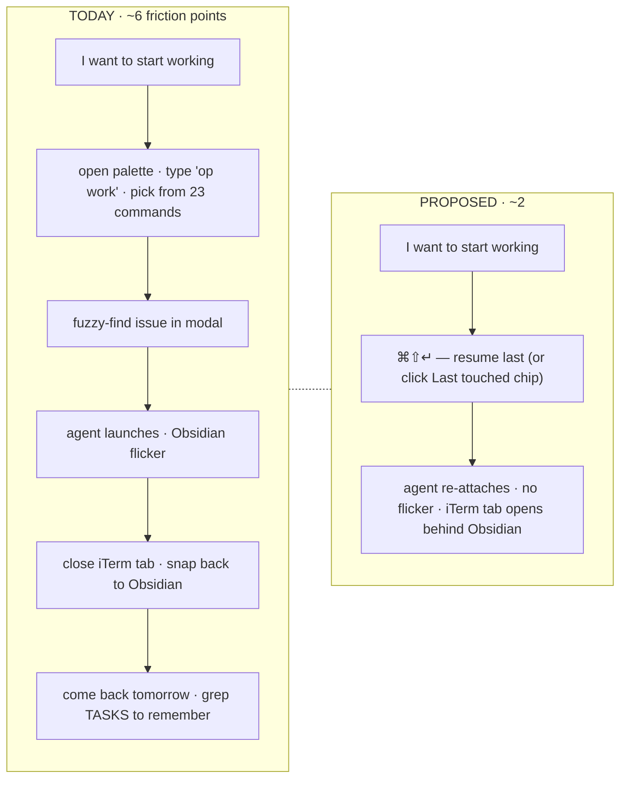
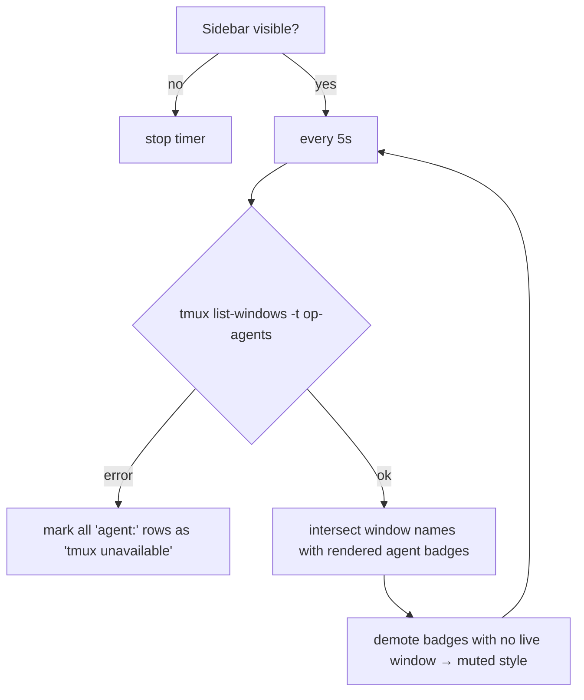
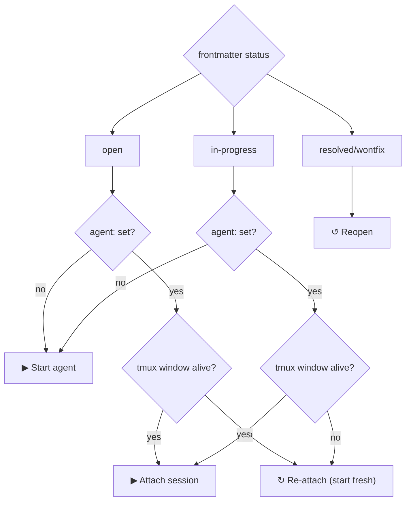
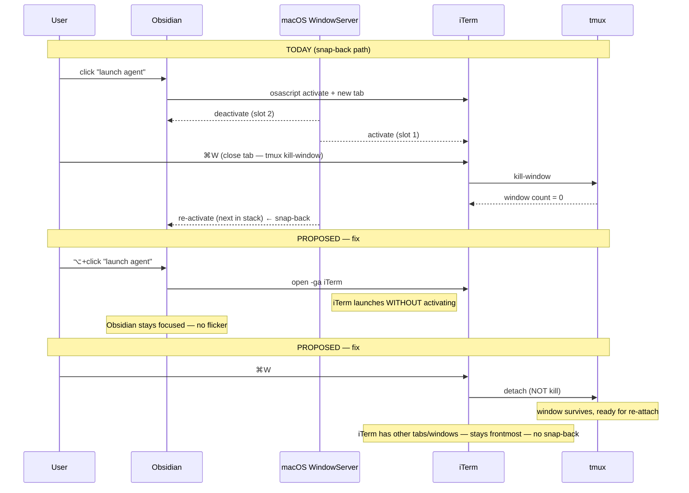
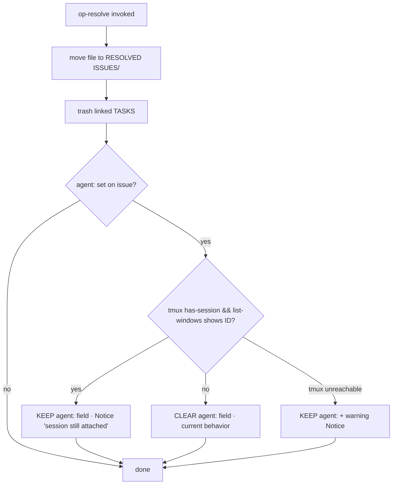
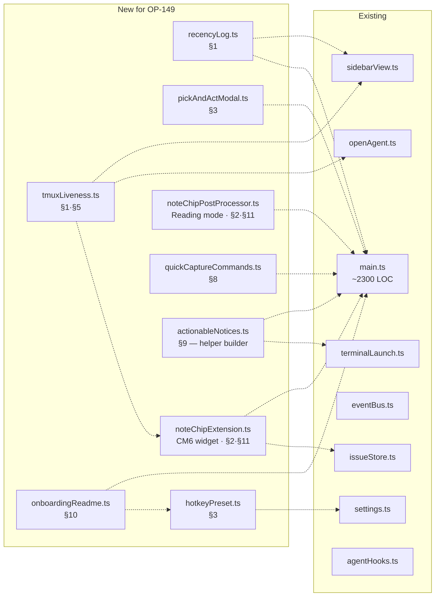

# OP-149 — Make op-obsidian feel great

## Why this exists

op-obsidian works. It has 27+ palette commands, a sidebar with launch/plan buttons, a tmux+iTerm orchestrator, GitHub mirroring, agent overlays, flow state. It is **functional**. It is not yet **good to use**.

This spec proposes a coherent set of UX changes whose collective goal is one sentence: **a power user should be able to drive a full issue from "thought" to "merged" without taking their hands off the keyboard, and never feel a jerk between Obsidian and the agent terminal.** Everything below is judged against that bar.

The seed prompt named themes (buttons in notes, sidebar, hotkeys, terminal transitions, badge persistence). The adversarial pass surfaced a missing one — **resumability** — which turns out to be the single biggest "feels great" lever and now leads the spec. A late addition is **Settings tab cleanup** (§13) — 11 H2 sections in one scroll is its own felt-bad. Status-bar widgets, animated leaf transitions, a custom dashboard view, and a second fuzzy-launcher are explicitly out of scope (rationale in §14).

## At a glance — the felt difference



The proposed path replaces the today-path's mid-flow tool-juggling with one ambient surface (sidebar header chip) and one keystroke (`⌘⇧↵`). Every section in this spec is in service of that compression.

## How to read this

Each section follows the same shape:

- **Today** — what currently exists in the codebase, briefly.
- **Proposed** — concrete change. Code shape where useful.
- **Why it feels better** — the felt difference, not the engineering one.
- **Cost / risk** — implementation cost, breakage risk, mobile/cross-platform impact.
- **Verdict** — `RECOMMEND` (do it), `HOLD` (good idea, blocked or premature), or `REJECT` (looks good, actually wrong).

Sections are independent. Each `RECOMMEND` becomes a follow-up issue.

---

## 1. Resumability — "what was I doing?" is one keystroke

**Today.** The sidebar's `In flight` tab lists issues with `status: in-progress` or with an `agent:` badge. There's no notion of *recency* — if you closed your laptop mid-OP-72 yesterday and start fresh today, you have to remember the issue ID or scroll. tmux keeps the agent session alive (good), but Obsidian doesn't know that, so the badge tells you nothing about *liveness* — only about whether `agent:` is set in frontmatter.

**Proposed.**

1. **Persist a recency log.** Every time `op-work`, `op-open-agent`, or sidebar-row-click fires, append `{issueId, at}` to `data.json` → `recent: [...]` (cap 25). Survives plugin reloads.
2. **New command `op: resume last`** — opens the most recent issue note; if its agent session is still alive in tmux (`tmux has-session && tmux list-windows | grep`), reattaches via the existing terminal launch path; otherwise just opens the note.
3. **Sidebar header chip.** Above the tab strip, a single line: `Last touched: OP-72 · agent attached · 2h ago` — clickable, executes `op: resume last`. Empty when `recent` is empty.
4. **Liveness probe in sidebar render.** Every 5s (only when sidebar is visible — drop the timer on `onClose`), probe `tmux list-windows -t op-agents -F '#W'` once, intersect with rendered `agent:` badges, and demote ghost badges (agent set in FM but no tmux window) to a muted "stale" style. This eliminates the "is this badge real or stale?" cognitive load.

**Sidebar header chip — sketch:**

```
┌──────────────────────────────────────────────────────┐
│ Last touched: OP-72 · agent attached · 2h ago    ↩  │  ← clickable
├──────────────────────────────────────────────────────┤
│  Issues   In flight   Recently resolved              │  ← existing tabs
├──────────────────────────────────────────────────────┤
│ 🔍 Filter issues…                                    │
├──────────────────────────────────────────────────────┤
│ OP-148 · refactor sidebar density …  [med] [▶][📋]   │
│ OP-149 · feel-great UX brainstorm    [med] (claude)  │
│ OP-150 · STALE BADGE FOR DEMO        [low] (gemini) │  ← rendered muted/struck
│ …                                                    │
└──────────────────────────────────────────────────────┘
```

**Liveness probe — when it runs:**



**Why it feels better.** The single highest-frequency op-obsidian action — figuring out what to work on next — becomes one keystroke. The sidebar stops lying about which agents are alive.

**Cost / risk.** Small. Recency log is ~30 LoC. Liveness probe is one `tmux` exec on a 5s interval gated on visibility — negligible. The probe is the only new platform call; on non-macOS it no-ops (tmux available everywhere we ship).

**Verdict.** `RECOMMEND` — leads. Highest leverage per LoC in the spec.

---

## 2. Buttons in notes — *one* contextual primary action

**Today.** No note-level UI. To act on an issue you go to the sidebar, the palette, or the URI scheme.

**Proposed.** Render exactly one decoration above the H1 of any note with `id: <PREFIX>-N`: a **single primary-action chip** whose label changes with state, plus an overflow menu (`⋯`) for less-common actions.

| Issue state | Primary chip | Overflow |
|---|---|---|
| `open` | **Start agent** | Set priority, Edit scope, Resolve as wontfix |
| `open` + `agent:` set but no tmux window | **Re-attach (start fresh)** | Clear stale agent, Resolve |
| `in-progress`, agent alive | **Attach session** | Append last commit, Set PR, Resolve |
| `in-progress`, no agent | **Start agent** | Same as above |
| `resolved` / `wontfix` | **Reopen** | Open linked GitHub issue |

Implementation: **CM6 widget** (`registerEditorExtension` + `WidgetType` + `Decoration.widget`) rendered above the first line, plus a mirror via `registerMarkdownPostProcessor` for Reading mode. Both read `app.metadataCache.getFileCache(file).frontmatter` — no codeblock syntax, no markdown surface area.

**Note-level chip — sketch (Live Preview / Reading mode):**

```
╔══════════════════════════════════════════════════════╗
║ ▶ Attach session                              ⋯      ║   ← chip + overflow
╠══════════════════════════════════════════════════════╣
║ # OP-72 — fix link escaping in markdown render       ║
║                                                      ║
║ ## Scope                                             ║
║ - [x] handle escaped brackets …                      ║
╚══════════════════════════════════════════════════════╝

  ⋯ overflow menu:
  ┌─────────────────────────────┐
  │ Append last commit          │
  │ Set PR…                     │
  │ Resolve…                    │
  │ ─────────────────────────── │
  │ Open linked GitHub issue ↗  │
  └─────────────────────────────┘
```

**Chip-state decision:**



**Why it feels better.** The note tells you what the *next obvious thing* is and lets you do it without leaving the note. Critical: it does NOT add a wall of buttons. Adversarial pass landed hard on this — five buttons under every issue is *worse* than zero.

**Cost / risk.** Medium. CM6 widgets are stable but break occasionally across Obsidian minor versions; we already use the metadata cache extensively, so the dependency surface doesn't grow. Reading-mode mirror is straightforward post-processor.

**Verdict.** `RECOMMEND`.

---

## 3. Hotkey-driven flow — opinionated preset + chord-free chains

**Today.** Every command is bindable in Settings → Hotkeys. Nothing is bound by default. The user is expected to discover and bind.

**Proposed.**

1. **Ship a named "op default" preset.** A button in the op settings tab applies the following bindings in one click (and shows the user what it changed; reversible). Choose ⌘-shifted bindings to avoid colliding with Obsidian core:

   | Keybinding | Command |
   |---|---|
   | `⌘⇧O` | op: open sidebar |
   | `⌘⇧I` | op: pick & act (new — see below) |
   | `⌘⇧↵` | op: resume last |
   | `⌘⇧A` | op: attach current issue's agent |
   | `⌘⇧L` | op: launch agent for current issue |
   | `⌘⇧R` | op: resolve current issue |
   | `⌘⇧N` | op: new issue (current project) |
   | `⌘⇧.` | op: append last commit |

2. **`op: pick & act` — single SuggestModal that does picking and acting in one step.** The footer hint shows `↵ open · ⌘↵ launch · ⌥↵ plan-mode · ⇧↵ resolve · ⌃↵ append commit`. This is the Omnisearch / Make.md / Raycast pattern — collapses the today's two-step "find issue, then run a command on it" into one modal.

**`op: pick & act` modal — sketch:**

```
┌──────────────────────────────────────────────────────────┐
│ 🔍  link esc                                             │
├──────────────────────────────────────────────────────────┤
│ ▸ OP-72   fix link escaping in markdown render  [in-progress]│
│   OP-104  link-check repair improvements        [open]   │
│   OP-138  per-project WORKFLOW link fix         [resolved]│
│   …                                                      │
├──────────────────────────────────────────────────────────┤
│ ↵ open · ⌘↵ launch · ⌥↵ plan · ⇧↵ resolve · ⌃↵ commit   │
└──────────────────────────────────────────────────────────┘
```

**Why it feels better.** Out of the box the user has a working keyboard workflow. Today the answer to "how do I drive this with the keyboard?" is "go bind 27 commands, good luck." The pick-and-act modal is the single most ergonomic surface for keyboard-only work — far better than a chord scheme that Obsidian doesn't natively support.

**Cost / risk.** Low. Hotkeys are user data; the preset must be opt-in (we mutate `app.hotkeyManager.customKeys` only on explicit click) and reversible. The modal is one new class on top of existing infrastructure.

**Verdict.** `RECOMMEND`.

---

## 4. Smoother Obsidian ↔ iTerm transitions

**Today.** Plugin runs `tell application "iTerm" to activate` then opens a tab/window. Closing the iTerm window snap-backs focus to Obsidian (macOS WindowServer rule, not our bug — but felt as our bug). Cold-launch flicker is ~250ms.

**Proposed.** Three concrete fixes from the focus research, none speculative:

1. **Background-launch mode.** New setting: "Launch agent without stealing focus." When on, the plugin runs `open -ga iTerm` (the `-g` flag launches without activation) for cold starts, and follows tab-create AppleScript with `tell application "Obsidian" to activate` to bounce focus back. Net result: agent boots in the background while the user keeps typing in their note. Default off (current behavior is what most people want when they hit "launch"); on for power users who use `op: launch agent` from inside a flow.
2. **Per-launch override.** `⌥+click` on the sidebar launch button, or `⌥↵` in the pick-and-act modal, toggles background launch for that one launch.
3. **Document tmux-CC "Hide on close tab" preference.** iTerm Prefs → Advanced → "When closing a tmux tab" → **Hide**. With this, closing an iTerm tab keeps the tmux window alive and the iTerm session in front — *eliminates* the snap-back to Obsidian for tmux-CC users. We can't set this for the user, but we can detect and prompt: on first launch with tmux-CC mode active, check `defaults read com.googlecode.iterm2 SuppressCloseTabConfirmationAlert` (best-effort proxy) and if the kill-on-close behavior is detected, emit a one-time clickable Notice with a "Open iTerm pref pane" link.

**Rejected as researched mirages:**
- *SwiftUI shim* — out of scope. Building a separate launcher binary to dodge focus rules adds an installation surface that nobody will accept for ~100ms of polish. The seed prompt mentioned this hopefully; the honest answer is no.
- *`tell System Events to set frontmost`* — same WindowServer call as `activate`, no behavioral change.
- *Custom ⌘W rebind in iTerm* — breaks "close tab" globally; non-starter.

**Focus stack — why the snap-back happens (and where each fix intervenes):**



**Why it feels better.** Two real fixes (`open -ga`, post-create activate-bounce) eliminate the worst transitions. The tmux-CC tip is a free win for users who take it.

**Cost / risk.** Tiny. macOS-only, which we already are.

**Verdict.** `RECOMMEND` for the two fixes + the prompt. `REJECT` SwiftUI shim.

---

## 5. Agent badge persistence across resolve

**Today.** When `op-resolve` runs, the issue moves to `RESOLVED ISSUES/`. The `agent:` frontmatter is preserved on the moved file, but the **sidebar's "in-flight" tab filters by `status === "in-progress" || agent set` AND excludes resolved**, so a resolved-but-still-attached agent disappears from the sidebar entirely. The user can't find their way back to the live session via the sidebar — only by remembering the tmux window name.

**Proposed.**

1. **`In flight` tab keeps showing resolved-but-live issues** as long as `agent:` is set AND a tmux window with that ID exists. Visually: show with a strikethrough or muted title and a `resolved` chip, but the badge stays clickable.
2. **On `op-resolve`, do NOT clear `agent:` if a live tmux window exists for the issue.** Today, `clearAgentOnIssue` is called in two places: from the SessionEnd hook (correct — session ended), and from the resolve flow (wrong if the session is still alive). Add a tmux-liveness check before clearing in the resolve path; if alive, leave `agent:` set and emit a Notice: "Agent session still attached — `agent:` field kept. It will clear when the session ends."
3. **`op: detach agent`** — explicit command that kills the tmux window for a given issue and clears `agent:`. Useful for cleanup of zombie sessions when the SessionEnd hook didn't fire (crashes).

**Resolve-path liveness gate — decision flow:**



**Why it feels better.** The seed prompt's exact phrasing — "ensure that agent sessions don't de-badge, that linkage is maintained even if we resolve, so long as the agent session is open" — is met exactly. No more "where did my agent go" after a too-eager resolve.

**Cost / risk.** Touches the resolve path, which is high-trust code (it moves files and trashes TASKS). Liveness check is `tmux has-session/list-windows`; failure modes (tmux down) should fall back to current behavior with a warning, not block resolve. This is the riskiest section in the spec — pair it with explicit Copilot pressure on "what if liveness probe lies."

**Verdict.** `RECOMMEND`, with a careful test plan around resolve-path failure modes.

---

## 6. Sidebar density — peripheral vision, not a second editor

**Today.** Sidebar has tabs (Issues / In flight / Recently resolved), a filter input, and a flat list. Each row: id+title, project chip, priority chip, agent badge or launch/plan buttons.

**Proposed.** Restraint, not addition. Adversarial pass landed: a busy sidebar is a second editor with no editor.

1. **Add the "Last touched" header chip from §1.** Single new structural element above the tab strip.
2. **Keyboard nav inside the sidebar.** `j/k` move selection, `↵` opens, `⌘↵` launches agent on the highlighted row, `r` resolves (with confirmation modal). Today the sidebar is mouse-only.
3. **Density preference.** Existing rows are already compact-ish. Add a single setting: `Sidebar density: comfortable | compact` — compact removes the project chip when only one project exists in the rendered list, and tightens vertical padding by 4px.
4. **Group-by-project as a pref, not a tab.** Settings toggle: `Group sidebar by project`. When on, the issues list gets collapsible project headers. Off by default; only useful with 3+ projects.

**Rejected from the seed:**
- *Multi-select bulk actions.* Issues aren't a list you want to bulk-act on (resolving 5 issues at once is a smell, not a feature). Drop.
- *Per-flow filters.* The `flow:` field is internal orchestration state; users don't think in those terms. Drop.

**Why it feels better.** Keyboard nav is the single missing piece for "no mouse" workflows in the existing surface. Everything else is a careful no.

**Cost / risk.** Low. All changes live in `sidebarView.ts`.

**Verdict.** `RECOMMEND` keyboard nav + Last-touched chip + density pref. `HOLD` group-by-project until a user actually has 3+ projects (pre-spec'd, ship behind the toggle later). `REJECT` multi-select and per-flow filters.

---

## 7. Command-palette ergonomics

**Today.** 27+ commands, all named `op: <verb>` or `op-dev: <verb>`. The `op:` prefix is good (groups them in fuzzy search). Some names are wordy: `op: open agent (pick at runtime)`, `op: migrate legacy parent_issue/subissues to parent/children`.

**Proposed.**

1. **Hide `op-dev:*` commands behind a setting.** Default off. They're for plugin-development debugging, not end-user workflow; they crowd the palette with `dump-store`, `rebuild-store`, `install-agent-hooks`, etc. Setting: `Show developer commands in palette` — off by default.
2. **Trim names.** `op: open agent (pick at runtime)` → `op: open agent (pick)`. `op: open agent for issue in PLAN MODE` → `op: open agent (plan mode)`. `op: migrate legacy parent_issue/subissues to parent/children` → `op: migrate legacy issue links`. Keep IDs stable for hotkey backwards-compat; only change the `name:` field.
3. **Add `op: resume last` (§1) and `op: pick & act` (§3) as the two highest-leverage new commands.** Don't add anything else this round.

**Rejected:**
- *Fuzzy aliases.* Obsidian's fuzzy search already handles "rsv" → "resolve". Aliases are a maintenance burden.
- *Smart-default verbs.* Changing what `op: open agent` means based on state is a usability hazard — users want predictability from named commands. The state-aware affordance lives in the note-level chip (§2), where state is visible.

**Why it feels better.** Less noise in the palette; shorter names that don't truncate in the dropdown.

**Cost / risk.** Trivial. Dev-commands gating is one `if (settings.showDevCommands)` around five `addCommand` calls.

**Verdict.** `RECOMMEND`.

---

## 8. Quick-capture: `op: new from selection / from clipboard`

**Today.** `op: new issue` opens an interactive modal asking for project, title, scope. To capture "this paragraph I'm reading" as an issue, you copy, run the command, paste into title or scope, fill the rest.

**Proposed.** Two new commands:

- **`op: new from selection`** — uses `editor.getSelection()` as the issue's scope body; auto-derives the title from the first line (with a confirmation modal pre-filled, so the user can edit before commit). If no selection, falls back to current note's title + a backlink to the source note in scope.
- **`op: new from clipboard`** — same, but from `navigator.clipboard.readText()`. Useful for capturing from outside Obsidian.

Both commands resolve the project from: (a) the active note's `project:` frontmatter if any, (b) the most-recent project from §1's recency log, (c) interactive picker as last resort. The interactive confirmation step is preserved per the op skill's "always pause for explicit user confirmation before mutating vault or repo" rule.

**Why it feels better.** Captures the moment-of-thought without breaking flow. Today, "I should make an issue for this" is a 6-step interruption; this makes it 2 steps (`⌘⇧N` → confirm).

**Cost / risk.** Low. Wraps existing `op-new` plumbing.

**Verdict.** `RECOMMEND`.

---

## 9. Actionable Notices

**Today.** Notices are plain strings. "Issue resolved", "Plugin reloaded", error messages with no recovery path.

**Proposed.** Migrate the high-value Notices to `DocumentFragment` form with inline `<a>` actions:

| Trigger | Today | Proposed |
|---|---|---|
| Resolve succeeded | `op: OP-72 resolved` | `op: OP-72 resolved · [Open]` (opens RESOLVED ISSUES path) |
| `op-new` succeeded | `op: created OP-149` | `op: created OP-149 · [Open] · [Start agent]` |
| GH issue close failed | `op: gh issue close errored` | `op: gh issue close failed · [Retry] · [Open log]` |
| Stale agent badge detected | (silent) | `op: OP-42 has no live agent · [Clear badge]` |
| tmux missing | `op: tmux not found at …` | (current text) `· [Open settings]` |

Use `createFragment` builder, set timeout `0` for actionable ones (sticky until clicked or dismissed).

**Why it feels better.** Errors stop being dead ends. Successes invite the next action.

**Cost / risk.** Trivial — replace string args with fragment args at ~10 call sites.

**Verdict.** `RECOMMEND`.

---

## 10. Onboarding — a working README, not a tour

**Today.** No first-run experience. Users read the GitHub README and figure it out.

**Proposed.** On first run (detected by a `firstRunCompleted: false` flag in `data.json`), create one note in the active vault: `Projects/_op-readme.md`. The note contains:

- A 4-line "what is this" intro.
- The hotkey preset table from §3, with a working **Apply preset** chip (CM6 widget calling `applyPreset()`).
- One **Start tour** chip that scaffolds a demo project (`op-demo`, prefix `OPD`) with three pre-seeded issues — the user can `/op:resolve` them as they explore. Removable in one click.
- A footer link to the GitHub repo.

No modals. The README is the tour. Dismissed by deleting the file (we don't recreate it).

**Why it feels better.** First impression goes from "open palette, type op, scroll" to "here is a working scaffolded environment, here are your hotkeys, hit ⌘⇧I to start." Adversarial pass landed on this — Excalidraw does it well, modal-tour plugins all flopped.

**Cost / risk.** Low. Reuses §2's CM6 widget infrastructure.

**Verdict.** `RECOMMEND`.

---

## 11. Note-level decorations: last commit, PR status

**Today.** `commits:` and `pr:` are frontmatter scalars; nothing surfaces them at read time. The user opens the issue note and sees raw YAML.

**Proposed.** A single right-aligned strip below the primary-action chip from §2:

`last commit: a1b2c3d "fix link escaping"  ·  PR #142 (open)  ·  GH #150 (open)`

- **last commit**: latest entry from `commits:`. Click → `git show <sha>` in a Notice (truncated) or copy-sha-to-clipboard.
- **PR**: from `pr:` field. Click → opens in browser. Status (`open`/`merged`/`closed`) fetched **lazily on render** with a 60s in-memory cache; offline → no status, just the link.
- **GH issue**: from `github_issue:`. Same pattern.

Each piece is omitted when the field is empty — no dead chips.

**Why it feels better.** The information you need to *act* on the issue (is the PR merged? is the GH issue still open?) is visible without a tool-switch. Today you switch to terminal or browser for every check.

**Cost / risk.** Lazy GH fetch needs auth; we already shell out to `gh` for issue creation/close, so reuse `gh pr view --json state` and `gh issue view --json state`. Add a "Disable inline GitHub status" setting for users without `gh` configured. Failure mode: just hide the status, never block render.

**Verdict.** `RECOMMEND`.

---

## 12. Drag/move across sidebar tabs (the "transition between states" piece)

**Today.** No drag interactions in the sidebar. State changes happen via commands.

The seed asked: *"can we drag or worst-case button/menu transition issues between states and have everything update properly (move them in the sidebar)"*.

**Proposed.** This sounds nice and is mostly a mirage:
- **Drag from `Issues` to `Recently resolved`** — would imply a "resolve via drag" gesture. But resolution is destructive (moves files, trashes TASKS, optionally closes GH); a drag is too easy to misfire. Resolution should remain explicit.
- **Drag to reorder within a tab** — there is no meaningful order today (sorted by ID); reordering would be ephemeral and confusing.

The right answer is **right-click context menus on sidebar rows** with the legitimate transitions: `Resolve…`, `Resolve as wontfix…`, `Reopen`, `Detach agent`, `Open GitHub issue`. Each command opens the existing confirmation modal — no destructive shortcuts. The sidebar already auto-updates on state change via the EventBus, so "move them in the sidebar" is solved by triggering the right command, not by simulating a drag.

**Why it feels better.** Right-click is the universal "what can I do with this row" gesture; today the sidebar has it nowhere.

**Cost / risk.** Tiny. Add `contextmenu` handler in `sidebarView.ts` `render()`, build via Obsidian's `Menu` class.

**Verdict.** `RECOMMEND` (right-click menus). `REJECT` (drag-to-resolve).

---

## 13. Settings tab UX cleanup

**Today.** `settings.ts` is 771 lines and renders **11 H2 sections** in one long scroll: *Agents, Injection, Working directories, Project order, Terminal, iTerm layout orchestrator, Sidebar view, GitHub integration, Agent worktree enforcement, Flow chaining,* plus an unheaded "General" block at top. There's a glossary `<details>` at the top defining tmux / orchestrator / overlay / worktree — useful, but it carries the weight of a UX problem (many settings are too jargon-laden to stand alone). Mixed in with daily knobs ("Default agent", "Sidebar default tab") are deeply technical ones ("Profile overlay JSON", "Layout orchestrator", "Agent worktree enforcement") with no visual hierarchy separating them.

Pain points the structure causes:
- New users hit the kitchen sink. There's no "you mostly only need these three things" landing.
- Power-user knobs (orchestrator, profile overlays, worktree enforcement) are intermingled with daily ones — every save-and-redisplay re-renders the whole tree, so changing a default agent re-paints 700px of unrelated UI.
- No search — only Cmd-F-on-the-page works, and Obsidian's settings already have a built-in search box that op doesn't participate in.
- Wordy `setDesc` strings (some > 200 chars). The glossary exists *because* the descriptions had to be terse; the result is two places to read for one setting.
- "Reset to alphabetical" hangs at the bottom of the *project-order* renderer instead of inside the Project order H2 — easy to miss.

**Proposed.**

1. **Two-tier organization.** Split the tab into a top **"Daily"** group and a collapsed-by-default **"Advanced"** group. Daily: Default agent, Terminal app, Sidebar default tab, Onboarding (§10), Hotkey preset apply button (§3). Advanced (each its own collapsible `<details>` inside the Advanced group): Injection, Working directories, Project order, iTerm layout orchestrator, Profile overlays, Agent worktree enforcement, Flow chaining, GitHub integration, Developer commands toggle (§7).
2. **Lift the glossary into per-section `<details>` headers**, not a top-level dump. Each Advanced section gets a 1–2 line "what is this?" expandable directly under the H2, so the description shrinks but context is one click away. Top-level glossary stays as a fallback.
3. **Search box at the top.** Type-to-filter that hides settings whose name + setDesc don't match. Uses the same `prepareFuzzySearch` we already use in the sidebar. ~25 LoC.
4. **Don't re-render the whole tab on every save.** Today, several settings call `this.display()` to refresh dependent UI (e.g. project order list, working-dir defaults). Replace with targeted re-renders of the affected section only — each section becomes a `renderSection(containerEl)` function that can be called in isolation. This eliminates the 700px scroll-jump on every toggle.
5. **Inline validation, not silent acceptance.** Profile-overlay JSON shows the validator's findings beneath the textarea immediately on edit (already partly there via `validateOverlay` — surface it inline rather than only on save). tmux binary path checks `existsSync` on blur and shows a green check or red ✗.
6. **Group "Project order" inside "Working directories"** — they both operate on the same project list and the visual disconnect (two H2s with different concerns) is confusing. Fold the order list into the Working directories section.
7. **Remove the orphan "Reset to alphabetical" button** from outside the Project order H2; bind it inside the renderer.

**Settings tab — proposed shape:**

```
┌─ op settings ────────────────────────────────────────┐
│ 🔍 Search settings…                                  │
│                                                      │
│ ── Daily ──────────────────────────────────────────  │
│ Default agent          [claude ▾]                    │
│ Terminal               [iTerm ▾]                     │
│ Sidebar default tab    [In flight ▾]                 │
│ Hotkey preset          [Apply op default]            │
│ Onboarding README      [Recreate]                    │
│                                                      │
│ ── Advanced ──────────────────────────────────────── │
│ ▸ Injection                                          │
│ ▸ Working directories & project order                │
│ ▸ iTerm layout orchestrator                          │
│ ▸ Profile overlays (per-agent JSON)                  │
│ ▸ Agent worktree enforcement                         │
│ ▸ Flow chaining                                      │
│ ▸ GitHub integration                                 │
│ ▸ Developer commands                                 │
│                                                      │
│ ▸ Glossary                                           │
└──────────────────────────────────────────────────────┘
```

**Why it feels better.** A new user sees five settings, not thirty. A returning user types in the search and finds the toggle in one second. The "I changed one thing and the page jumped 600px" annoyance disappears. Power-user surface is still all there, just one fold-down away.

**Cost / risk.** Medium — a refactor of 771 LoC into ~10 `renderSection(el)` functions, plus the search filter, plus the two-tier wrapper. Low behavioral risk: setting semantics don't change, only their layout. Bigger risk is breaking the existing settings tab smoke-test recipe in CLAUDE.md (`app.setting.openTabById("op-obsidian")`); the recipe still works, but assertions counting `.op-project-order__item` need to account for the section being inside a `<details>` (still in the DOM, just nested).

**Verdict.** `RECOMMEND`. Lands as its own follow-up issue — the spec's biggest single PR by LoC, but pure restructure with ~zero new behavior to test.

---

## 14. Explicit no-pile

These have surface appeal and are not in scope. Naming them prevents drift.

| Idea | Why no |
|---|---|
| **Status bar widget showing active issue / agent count** | Status bar is a graveyard. Use the sidebar header chip (§1) instead. |
| **Custom "dashboard" `ItemView` as home base** | New chrome users have to learn and position. Notes are the home base; we layer on top. |
| **Second fuzzy launcher** | Obsidian has one. Lean on it harder via `op: pick & act` (§3). |
| **Animated transitions between leaves** | Workspace API exposes no tween hooks. Jump-cuts only. |
| **AI summary of issue at top of note** | Slow, stale, steals first-eyeful from human-authored title. |
| **Multi-select bulk operations** | Bulk-resolving is a smell; per-issue intent is the right grain. |
| **Per-flow filter UI** | `flow:` is orchestration state; users don't think in those terms. |
| **Drag-to-resolve** | Destructive operations need explicit confirmation, not gestures. |
| **SwiftUI launcher shim** | Out of scope; ~100ms of polish doesn't justify a separate binary. |
| **Cross-vault sync of recency log** | YAGNI. Single-machine recency is the 95% case. |
| **Mobile UI parity** | Not deferred — explicitly out of scope. The plugin's value (terminal launches) doesn't exist on mobile. |

---

## 15. Architecture — what's new vs. existing



No existing module is gutted; new code clusters into single-purpose files. `main.ts` only gains command registrations + extension wiring (~80 LoC added).

## 16. Implementation order if all `RECOMMEND`s are accepted

Each section becomes its own follow-up issue, sized for one PR. Suggested sequence (smaller → larger, builds on infrastructure introduced earlier):

1. **§7 Palette ergonomics** (1 PR, ~30 LoC) — name trims + dev-command gating. Zero risk, immediate "feels less cluttered" win.
2. **§9 Actionable Notices** (1 PR, ~80 LoC). Pure UI; no behavior change beyond click handlers.
3. **§3 Hotkey preset + `op: pick & act`** (1 PR, ~200 LoC). The opinionated preset is the foundation everything else binds to.
4. **§1 Resumability** (1 PR, ~150 LoC) — recency log + `op: resume last` + sidebar chip + liveness probe.
5. **§6 Sidebar polish** (1 PR, ~120 LoC) — keyboard nav + density pref + right-click menus (§12).
6. **§5 Badge persistence across resolve** (1 PR, ~100 LoC; needs careful tests). Sequenced after liveness probe (§1) lands.
7. **§2 Note-level primary chip + §11 status strip + §10 onboarding README** (1 PR, ~300 LoC). Shares the CM6 widget infrastructure — bundle.
8. **§4 Terminal transition fixes** (1 PR, ~80 LoC). macOS-only; opt-in setting.
9. **§8 Quick-capture** (1 PR, ~80 LoC). Standalone; can ship anywhere in the sequence.
10. **§13 Settings tab restructure** (1 PR, ~400 LoC moved + ~80 new). Biggest single PR but pure restructure; ship after the chip+onboarding bundle so the new "Onboarding" daily setting has somewhere to live.

Total: 10 PRs, roughly 1,600 LoC touched (1,200 new + 400 moved), no breaking changes to setting semantics. Each PR ships independently.

## 17. Open questions for first review pass

These are deliberate ambiguities for the user / Copilot review to push back on:

1. **Hotkey preset bindings (§3 table)** — are `⌘⇧*` the right modifiers? Conflicts with any user's existing setup are inevitable; should the preset be "best effort" (skip already-bound keys) or "all or nothing"?
2. **Liveness probe interval (§1, §5)** — 5s feels right for sidebar visibility; is it cheap enough to also run on every issue-note open, so the chip in §2 is always accurate?
3. **GH status fetch (§11)** — opt-in or opt-out by default? `gh` is on the user's path or it isn't; we can detect, but defaulting to "off if not configured" vs. "on with a one-time prompt" is a UX call.
4. **Onboarding README path (§10)** — `Projects/_op-readme.md` puts it under the user's projects folder. Should it live elsewhere to avoid noise in the project list?
5. **Resolve-path liveness check (§5)** — if `tmux has-session` itself fails (tmux uninstalled mid-session), do we block resolve, warn-and-clear, or warn-and-keep? The conservative choice is warn-and-keep, but that leaves zombie `agent:` fields when tmux is genuinely gone.

These are flagged for the adversarial review pass.
