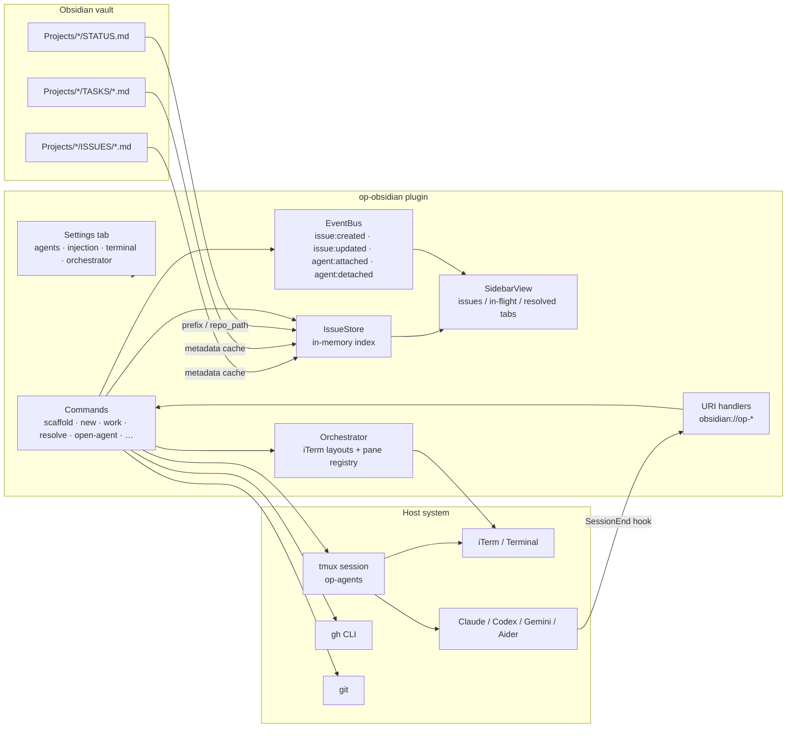

# Obsidian Projects (op) — Obsidian plugin

A Jira-lite issue tracker that lives inside your vault. Each project is a folder, each issue a markdown note with structured frontmatter, and each workflow step (scaffold, new, work, resolve) is a deterministic command you can run from the command palette, the sidebar, the `obsidian://` URI scheme, or the `obsidian` CLI.

The plugin is the typed, in-vault half of the [`op` workflow](../op/). The paired Claude Code skill drives the same operations from an AI agent; both sides read and write the same schema, so you can switch between them at any point.

## What you get

- **Sidebar view** with tabs for open issues, in-flight (agent attached) issues, and recently resolved issues. Click an issue to open the note; click the agent button to reveal its tmux window.
- **Command palette verbs**: scaffold a project, create an issue, start work (which flips status and can launch an agent in a tmux window), append a commit SHA, set PR / GitHub URLs, resolve.
- **Agent orchestration**: launch Claude / Codex / etc. in a shared `op-agents` tmux session, one window per issue, optionally laid out in iTerm panes.
- **GitHub linking**: auto-create a GitHub issue when creating an op issue, and auto-close it on resolve (requires `gh` CLI).
- **URI handlers**: every command is reachable as `obsidian://op-<verb>?…` so external tools (the op skill, shortcuts, raycast) can drive the plugin.

## Install

### Via BRAT (recommended until the plugin ships to community store)

1. Install [BRAT](https://github.com/TfTHacker/obsidian42-brat) from the Obsidian community store.
2. `BRAT → Add Beta Plugin with frozen version` → `https://github.com/earchibald/obsidian-projects` → pick the latest `op-obsidian-v*` tag.
3. Enable **Obsidian Projects (op)** under `Settings → Community plugins`.

BRAT will track the monorepo's `op-obsidian-v*` release tags and pull `main.js` + `manifest.json` automatically.

### From source

```bash
git clone https://github.com/earchibald/obsidian-projects
cd obsidian-projects/plugins/op-obsidian
npm install
npm run build
```

Then copy `main.js` and `manifest.json` into `<vault>/.obsidian/plugins/op-obsidian/` and enable the plugin. The repo's `CLAUDE.md` documents the exact reload dance used during development.

## Command reference

All commands are registered in the Obsidian command palette under the `op:` prefix. The `id` column is the programmatic ID used by `executeCommandById` and the URI scheme (`obsidian://<id>?…`).

| Id | Palette name | Purpose |
| :--- | :--- | :--- |
| `op-open-sidebar` | op: open sidebar | Reveal the op sidebar in the right split. |
| `op-scaffold` | op: scaffold new project | Create a new `Projects/<slug>/` folder with `<slug>.base` + `STATUS.md`. |
| `op-new` | op: new issue | Create a new issue in an existing project (prompts for title / priority / scope). |
| `op-find-issue` | op: find issue | Fuzzy-pick any issue and open its note. |
| `op-work` | op: work on issue | Flip status to `in-progress`, create a TASKS note, optionally launch an agent. |
| `op-open-agent` | op: open agent for issue | Launch the default agent in tmux for the active or picked issue. |
| `op-open-agent-pick` | op: open agent (pick at runtime) | Same as above but show the agent picker. |
| `op-append-commit` | op: append commit to issue | Append `<sha7> <subject>` of HEAD (in the project's repo) to the issue's `commits:` list. |
| `op-set-pr` | op: set PR URL on issue | Write a URL to the issue's `pr:` field. |
| `op-set-github-issue` | op: set GitHub issue URL on issue | Write a URL to `github_issue:`. |
| `op-create-github-issue` | op: create GitHub issue for this issue | Run `gh issue create` in the project's repo and link the result. |
| `op-open-github-issue` | op: open linked GitHub issue in browser | Open `github_issue:` in the system browser. |
| `op-resolve` | op: resolve issue… | Confirm-then-run the resolve lifecycle on the active issue. |
| `op-close-current-issue` | op: close current issue | Same as resolve; visible only when an issue note is active. |
| `op-install-agent-hooks` | op: install SessionEnd hooks for agents | Install Claude Code SessionEnd hook so `op-agent-ended` fires on exit. |
| `op-debug-agent-launch` | op: open agent to debug agent launch | Diagnostic launch that surfaces every step of the launch pipeline. |
| `op-dump-store` | op: dev — dump IssueStore to console | Log the in-memory issue/task store. |
| `op-rebuild-store` | op: dev — rebuild IssueStore | Force a full rescan of `Projects/`. |

### URI scheme

Every non-dev command is also an `obsidian://` URL. Common examples:

```
obsidian://op-new?project=jira-bases&title=fix+link+escaping&priority=high
obsidian://op-work?issue=OP-57
obsidian://op-open-agent?issue=OP-57&agent=claude
obsidian://op-resolve?issue=OP-57
```

## Settings reference

Found at `Settings → Community plugins → Obsidian Projects (op)`.

### Agents

- **Default agent** — which agent (`claude`, `codex`, `gemini`, `aider`, …) `op: open agent for issue` launches.
- **Always prompt for agent** — force the picker every time.
- **Detection** — summary of which agent binaries were found on `PATH`. Click **Re-probe** after installing a new agent.
- **Profile overlays** — per-agent JSON overlay merged over the built-in profile. Keys: `binary`, `launchFlags` (string[]), `promptPreamble`, `skillTrigger`, `label`.

### Injection

What gets prepended to the prompt when launching an agent. Toggles for including the issue body (with a character cap), linked TASKS, and recent commits; free-text extra preamble that's always included.

### Working directories

Per-project repo paths (slug → absolute path). Overridden by a `repo_path:` in `STATUS.md`. Needed for `op-append-commit`, `op-create-github-issue`, and launching agents in the right CWD.

### Terminal

- **Terminal app** — `Terminal` (plain tmux) or `iTerm` (`tmux -CC` control mode). All agents share one tmux session (`op-agents`), one window per issue, so agents survive the terminal closing (reattach with `tmux attach -t op-agents`).
- **tmux binary** — absolute path. Obsidian's `PATH` omits `/opt/homebrew/bin`, so bare `tmux` fails on Apple Silicon brew installs; set `/opt/homebrew/bin/tmux` or `/usr/local/bin/tmux` explicitly.
- **iTerm window placement** — new tab in front window vs. new window.

### iTerm layout orchestrator

Optional. When enabled, op arranges agent panes in the current iTerm window using the chosen layout (`1x1`, `2x1`, `2x2`, `3x2`, …). Overflow spills to a new iTerm window with a fresh tmux session. macOS + iTerm only.

### Sidebar view

- **Default tab** — `issues`, `in-flight`, or `resolved`.
- **Recently resolved limit** — cap for the resolved tab.
- **Open on startup** — reveal the sidebar automatically.

### GitHub integration

Requires `gh` CLI, authenticated, run in the project's repo.

- **Auto-create GitHub issue on new op issue** — call `gh issue create` when an op issue is created without a URL.
- **Close linked GitHub issue on resolve** — `gh issue close` the linked issue at resolve time.

## Architecture



Key pieces:

- **IssueStore** (`src/issueStore.ts`) — scans `Projects/**` on load and on vault events, keeping a typed cache of issues and tasks keyed by id. Everything in the UI reads from here.
- **EventBus** (`src/eventBus.ts`) — pub/sub for lifecycle events so the sidebar, the orchestrator, and external code can react without polling.
- **Sidebar** (`src/sidebarView.ts`, `src/layout/`) — three tabs backed by the store; each entry shows status, agent attachment, and clickable actions.
- **Commands** (`src/main.ts`, `src/workIssue.ts`, `src/resolve.ts`, `src/createIssue.ts`, …) — the verbs above. Same call paths are used by the palette, URI handlers, and CLI handlers.
- **Agent launch pipeline** (`src/openAgent.ts`, `src/terminalLaunch.ts`, `src/agentDetect.ts`, `src/promptBuild.ts`) — detects binaries, builds the prompt (with injection), picks a terminal, and launches inside the shared tmux session.
- **Orchestrator** (`src/orchestrator.ts`, `src/layout/`) — tracks which iTerm pane each issue is attached to and lays out new launches into the configured grid.
- **SessionEnd hook** (`src/agentHooks.ts`, `src/agentSessionCleanup.ts`) — installs a Claude Code hook that fires `obsidian://op-agent-ended?issue=…` when an agent exits, so the sidebar can flip the in-flight marker off.

## Troubleshooting

### "op: default agent not found" or agent never launches

Open `Settings → Obsidian Projects (op) → Agents → Detection` and click **Re-probe**. If the binary still shows "not found":

- Confirm it's on your shell's `PATH` (`which claude`, `which codex`).
- Obsidian inherits the GUI-launch environment, which differs from Terminal. Either install the binary somewhere in the default system `PATH` (`/usr/local/bin`, `/opt/homebrew/bin`), or set an overlay with the absolute path: `{"binary": "/Users/you/.local/bin/claude"}`.

### tmux: "command not found" or silent failure when launching an agent

Obsidian's `PATH` does not include `/opt/homebrew/bin`. Set **Settings → Terminal → tmux binary** to the absolute path (`/opt/homebrew/bin/tmux` on Apple Silicon brew, `/usr/local/bin/tmux` on Intel brew, `/usr/bin/tmux` on system tmux).

### The agent window never opens, or opens then disappears

- Start `tmux attach -t op-agents` in Terminal — if the session exists, the window is there but iTerm failed to attach. Try the `op: open agent to debug agent launch` command for a trace.
- If iTerm is running but the tab didn't appear, confirm **Settings → Terminal → iTerm window placement** is what you expect, and that iTerm's AppleScript permissions are granted (`System Settings → Privacy → Automation → Obsidian → iTerm`).
- If you were running with the orchestrator on, click **Reset pane assignments** under iTerm layout orchestrator — a stale mapping to a closed window can block new launches.

### "working directory missing" when running `op-append-commit`, `op-create-github-issue`, or launching an agent

The plugin needs a filesystem path to the project's code repo. Set it in one of:

1. `STATUS.md` frontmatter: `repo_path: /absolute/path/to/repo` (preferred — travels with the vault).
2. Plugin settings → Working directories → add `<slug>` → `/absolute/path/to/repo`.

### Agent sidebar chip stays "in-flight" after I quit the agent

Run `op: install SessionEnd hooks for agents` once. This writes a Claude Code hook that fires `obsidian://op-agent-ended?issue=…` on exit. If you're using a non-Claude agent, currently the only recovery is to click the chip, which probes tmux and clears the state.

### `op-new` / `op-work` doesn't find my project by prefix

The plugin reads `prefix:` from `Projects/<slug>/STATUS.md`. If the prefix is missing or mistyped, set it explicitly:

```
obsidian property:set name=prefix value=OP path="Projects/obsidian-projects/STATUS.md"
```

### Dev: the sidebar shows stale counts

Run `op: dev — rebuild IssueStore` to force a rescan. File this as a bug if it recurs outside of manual filesystem edits.

## Versioning

All three version surfaces — `plugins/op-obsidian/manifest.json`, `plugins/op-obsidian/package.json`, and `plugins/op/.claude-plugin/plugin.json` — bump in lockstep via:

```bash
node scripts/bump-version.mjs patch   # or minor / major / <explicit-version>
```

See the repo-root `CLAUDE.md` for the full post-edit build/copy/reload/smoke-test workflow.
